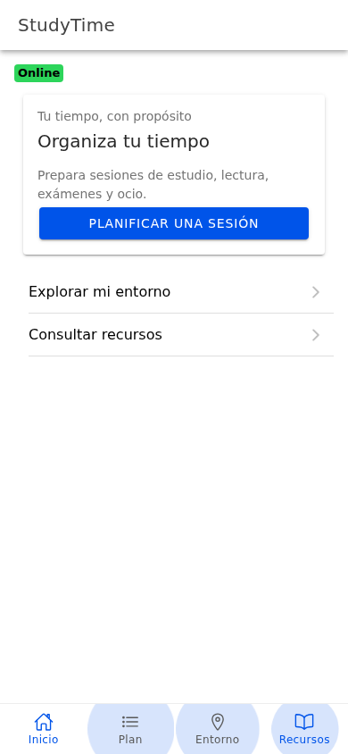
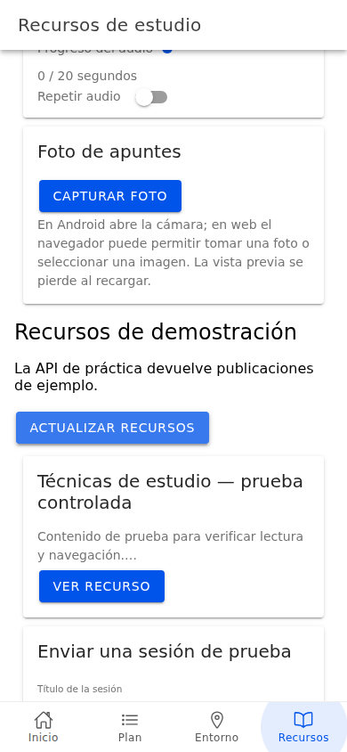
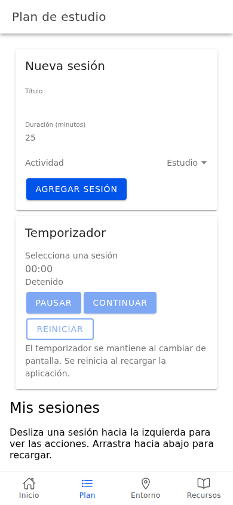
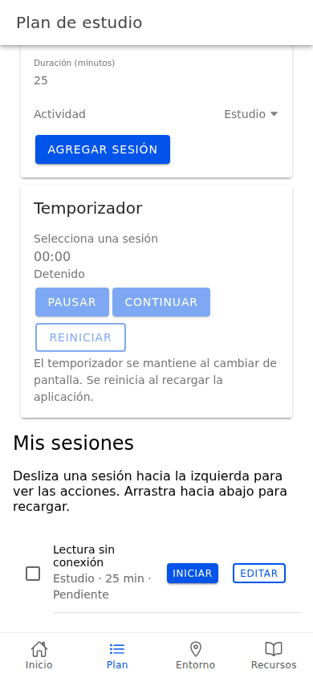
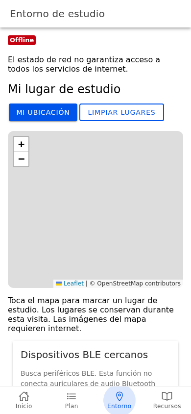
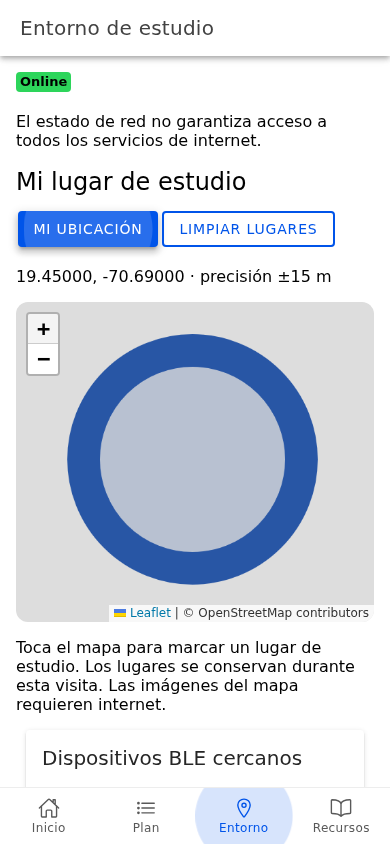
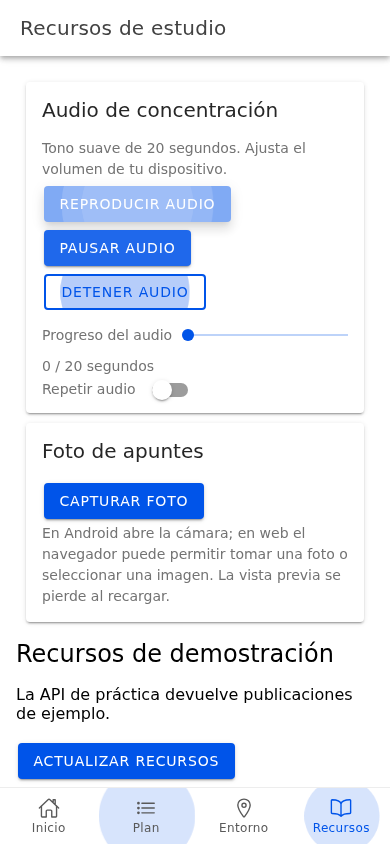
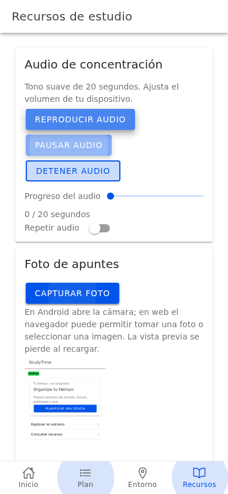

# StudyTime — Grupo P

Aplicación Ionic + Angular + Capacitor para organizar sesiones de estudio, lectura, exámenes y ocio. Integra navegación, temporizador, CRUD local, red, mapa/GPS, BLE, audio, cámara y API REST mediante pasos explicados y pruebas automatizadas.

## Estado real

Código integrado y validado parcialmente en Chromium 153 y Node 24.19.0. `npm run build`, `npm run lint` y las cinco suites de `npm run test:e2e` pasaron. No hay errores JavaScript no controlados en las suites ejecutadas.

La API pública no fue accesible desde el entorno de prueba: GET/POST exitosos se comprobaron con respuestas interceptadas; el fallo real mostró el mensaje previsto. GPS se validó con ubicación emulada. Cámara web se validó seleccionando un PNG de prueba. El escaneo BLE, GPS y cámara con hardware físico siguen pendientes. El mapa funciona en sus controles y marcadores; no se acredita la descarga de teselas externas.

El proyecto Android está creado y sincronizado. No se generó APK local: no hay SDK Android configurado y el Java disponible es 17. GitHub Actions compiló correctamente con Java 21 y publicó el APK debug. El artefacto `studytime-android-debug` está disponible en la ejecución enlazada abajo; todavía no se instaló en un teléfono.

**GitHub: el [PR #1](https://github.com/sftwrenginr/StudyTime_GrupoP/pull/1) fue aceptado y la aplicación está en `main`.** La [ejecución de main](https://github.com/sftwrenginr/StudyTime_GrupoP/actions/runs/37371974148) completó correctamente el job Android y publicó el artefacto. El job web fue cancelado y se solicitó reintentar únicamente ese trabajo. La compilación, lint, cuatro pruebas BLE y cinco suites web pasaron nuevamente de forma local. El registro de integridad del APK está en [android-apk.json](documentacion/evidencias/android-apk.json).

## Equipo y distribución académica

| Integrante | Módulo asignado para estudio y defensa | Unidades |
| --- | --- | --- |
| Luis Solano | Navegación y API REST | 1, 2, 10 |
| Joseph Reina | Sesiones, gestos, temporizador y CRUD | 3, 9 |
| Alexander Tejeda | Red, mapa/GPS y BLE | 4, 5, 6 |
| Alex Santana | Audio y cámara | 7, 8 |

Las matrículas no fueron proporcionadas. Esta distribución no afirma autoría del código: la implementación y las pruebas aquí registradas fueron realizadas por el asistente con asistencia de IA declarada, a petición del usuario. Las bases provienen de la CLI oficial Ionic. No se han inventado contribuciones de integrantes, reuniones ni pruebas en sus dispositivos. Esta modalidad de elaboración no modifica la política del PDF de la asignatura.

## Instalación y ejecución

Desde la carpeta de este avance:

```bash
cd app
npm ci
npx ionic serve
```

Alternativa: `npm start`. El entorno probado usa Node 24.19.0. Los comandos requieren conexión para instalar dependencias. El avance se puede obtener con `git clone --branch main https://github.com/sftwrenginr/StudyTime_GrupoP.git`.

```bash
npm run build
npm run lint
npm run test:ble
npx playwright install chromium
npm run test:e2e
```

Las pruebas generan capturas y registros bajo `documentacion/`. Las respuestas REST controladas, GPS emulado e imagen de prueba se identifican en esos registros. El temporizador mantiene su estado entre pantallas pero no tras recargar. CRUD y audio funcionan sin red en una aplicación ya cargada; no se ha creado una PWA capaz de arrancar desde cero offline.

La cancelación BLE descarta respuestas tardías al salir de Entorno. Pasaron cuatro pruebas específicas con el plugin controlado, además de build, lint y la suite Entorno.

## Tecnologías instaladas

| Tecnología | Versión comprobada | Uso |
| --- | --- | --- |
| Ionic Angular | 9.0.6 | Componentes y navegación |
| Angular | 22.1.7 | NgModules, rutas, signals y HttpClient |
| Capacitor core/CLI/Android | 8.5.2 | Runtime y proyecto Android |
| Capacitor Network | 8.0.1 | Estado online/offline |
| Capacitor Geolocation | 8.2.3 | Posición y permisos |
| Capacitor Camera | 8.2.5 | `takePhoto` y vista previa |
| Community Bluetooth LE | 8.3.0 | Escaneo nativo y selección web |
| Ionic Storage Angular | Consultar lockfile/registro de dependencias | CRUD respaldado exclusivamente por IndexedDB |
| Leaflet | Consultar lockfile/registro de dependencias | Mapa, controles y marcadores |

La CLI agregó también App, Haptics, Keyboard y Status Bar; su presencia no se cuenta como funcionalidad propia. Las versiones completas están en [dependencias](documentacion/evidencias/dependencias.txt) y `app/package-lock.json`.

## Organización

- `app/src/app/home/`: Inicio, conservado de la base oficial.
- `app/src/app/pages/`: tabs, Plan, Entorno y Recursos; detalle dentro de Recursos.
- `app/src/app/services/`: REST, sesiones, temporizador, red y BLE.
- `app/src/app/models/`: tipos de recursos y sesiones.
- `app/src/app/components/`: multimedia/cámara.
- `app/src/assets/`: audio local e imágenes base.
- `app/android/`: proyecto nativo con configuración y permisos.
- `app/scripts/`: pruebas E2E reproducibles.
- `documentacion/`: explicación, arquitectura, decisiones, pruebas y capturas.

## Documentación y evidencias

[Plan y reparto](documentacion/PLAN_TRABAJO.md) · [Desarrollo explicado](documentacion/DESARROLLO_MODULOS.md) · [Arquitectura, Canvas y diseño](documentacion/ARQUITECTURA_Y_DISENO.md) · [Bitácora](documentacion/BITACORA.md) · [Validación y pendientes](documentacion/VALIDACION.md) · [Referencias](documentacion/REFERENCIAS.md).


### Módulo 1





### Módulo 2





### Módulo 3





### Módulo 4






## Automatización preparada para GitHub

`.github/workflows/studytime.yml` define dos trabajos: build/lint y pruebas web con evidencias, y compilación Android debug. Los jobs tienen acceso de lectura al repositorio. El workflow no publica un sitio, no firma un APK de producción y generó el APK debug en GitHub. El resultado del reintento web sigue pendiente.

## Antecedentes

Se conservan `detector_red/`, `modo_offline/` y la documentación original de Unidad IV. La implementación actual está en `app/`, no en esas carpetas históricas. Los documentos `AVANCE_01.md` y `MODULO_1_PASO_1.md` describen etapas anteriores; para estado actual consulta este README y VALIDACION.

## Alcance del repositorio

Este repositorio contiene la aplicación, las instrucciones técnicas y las evidencias de validación. El informe académico, la presentación y los guiones de exposición se trabajan aparte y no se incorporarán a GitHub.
