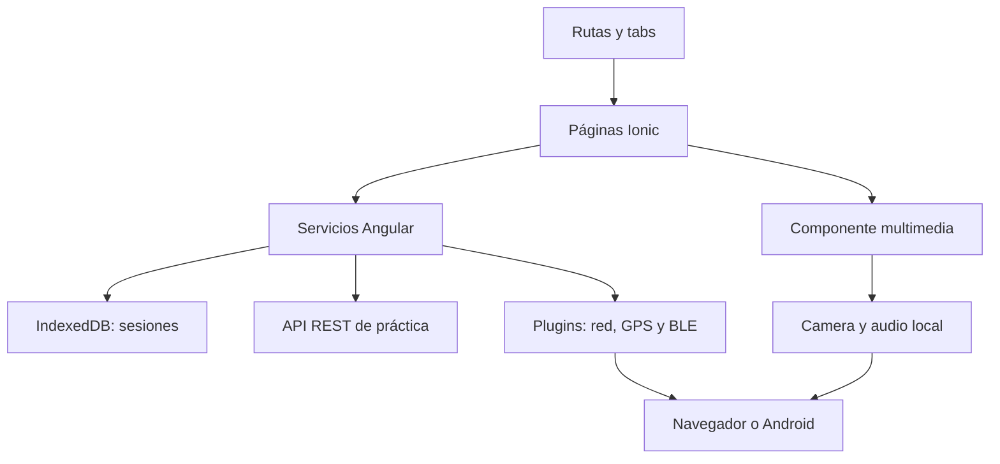

# Arquitectura, alcance y diseño de StudyTime

Documento técnico del prototipo asistido por IA. No sustituye un informe académico final con matrículas, portada UAPA, índice paginado y evidencias de hardware.

## Problema y objetivos

Los estudiantes necesitan organizar períodos de estudio, lectura, preparación de exámenes y ocio sin depender siempre de internet. StudyTime reúne planificación, un contador simple y recursos auxiliares en una misma aplicación.

El objetivo general es implementar un prototipo Ionic, Angular y Capacitor que permita planificar actividades y ejercitar las diez unidades de ISW-307. Los objetivos específicos son conectar cuatro páginas con tabs y carga diferida; gestionar sesiones con CRUD persistente; detectar red y obtener posición con un mapa; integrar BLE, audio y cámara; y manejar peticiones REST con carga, validación y errores.

El alcance es un prototipo local para estudiantes. No tiene autenticación, pagos, cuentas compartidas, sincronización automática, servidor persistente, navegación GPS, geofencing ni edición de fotografías. No se garantiza arrancar la web offline desde cero. La app Android y las funciones físicas requieren pruebas posteriores.

## Capas

| Capa | Responsabilidad | Ejemplos |
| --- | --- | --- |
| Vista | Datos visibles y acciones del usuario | formularios, listas, mapa, cards |
| Navegación | Conectar pantallas y separar módulos | tabs.module.ts, app-routing.module.ts |
| Servicios | Operaciones y estado que no deben mezclarse con HTML | API, sesiones, temporizador, red, BLE |
| Persistencia | Conservar sesiones y estados | @ionic/storage-angular con IndexedDB |
| Integraciones | Pedir funciones externas o del equipo | HttpClient, Capacitor, Leaflet, HTMLMediaElement |

Flujo REST: click → método de página → ApiService → HttpClient → respuesta/error → signal → vista. Flujo CRUD: formulario validado → SesionesService → promesa de apertura → lista IndexedDB → actualización de la vista. El temporizador es un servicio raíz y mantiene su estado entre páginas.

## Datos

Una sesión contiene `id`, `titulo`, `minutos`, `tipo` y `completada`. El ID lo genera `crypto.randomUUID()`. La colección `sesiones` se guarda como lista en IndexedDB. Recurso representa `id`, `userId`, `title` y `body` de la API de práctica. Las fotos y los lugares marcados no tienen persistencia propia.

## Navegación y diseño

Las cuatro tabs son Inicio, Plan, Entorno y Recursos. Recursos abre Detalle del recurso, con botón de regreso. Inicio incluye accesos a Plan, Entorno y Recursos. Las transiciones y el historial los maneja Ionic.

| Pantalla | Estructura aplicada |
| --- | --- |
| Inicio | Encabezado StudyTime, estado de red, presentación, botón Planificar y accesos |
| Plan | Formulario de sesión, temporizador y lista con acciones deslizables |
| Entorno | Estado de red, botón ubicación, mapa/controles y panel BLE |
| Recursos | Reproductor, captura/vista previa, lista API y formulario POST |
| Detalle | Encabezado/regreso, carga/error y contenido del recurso |

Se usaron estilos de Ionic con cards, encabezados, botones, inputs, listas y controles adaptables. No se añadieron animaciones personalizadas ni un sistema de diseño avanzado. La guía utiliza el azul primario predeterminado de Ionic (`#0054E9`), blanco (`#FFFFFF`), gris de texto secundario y colores semánticos success/danger; el modo oscuro puede seguir la preferencia del sistema. No se estableció una fuente externa: Ionic utiliza su pila tipográfica de plataforma. Las capturas muestran el resultado real en un viewport móvil de 390 × 844; no son bocetos anteriores al desarrollo.

## Canvas propuesto, no negocio existente

| Bloque | Propuesta académica |
| --- | --- |
| Segmentos | Estudiantes universitarios que desean organizar actividades |
| Valor | Planificación simple, temporizador y persistencia local |
| Canales | Demostración web y posible APK Android de prueba |
| Relación | Guía breve y registro de problemas en el repositorio |
| Ingresos | Prototipo gratuito; no se monetiza esta versión |
| Recursos | Código Ionic, dispositivos de prueba, documentación y API pública de práctica |
| Actividades | Desarrollo gradual, pruebas y mantenimiento |
| Socios | Posibles aliados educativos y proveedores de herramientas; sin convenios declarados |
| Costos | Tiempo de desarrollo, conectividad y equipos de prueba; sin presupuestos inventados |

## Manual breve

Inicio permite llegar a Plan. En Plan se escribe título y minutos, se elige actividad y se agrega la sesión. Editar modifica la sesión existente; la casilla cambia su estado; deslizar permite eliminar con confirmación. Iniciar carga su duración en el contador. Pausar, Continuar y Reiniciar actúan sobre el contador; cambiar de pantalla conserva el estado.

En Entorno, Mi ubicación pide permiso y sitúa el marcador. Tocar el mapa añade un lugar; Limpiar lugares retira esos puntos. Buscar dispositivos usa BLE en un dispositivo compatible o muestra la limitación. No es un emparejador de auriculares clásicos.

Recursos permite reproducir el tono local, pausar, detener, mover progreso y repetir. Capturar foto abre la capacidad que ofrece el dispositivo/navegador. Quitar foto limpia la vista previa. Actualizar recursos consulta la API. Enviar prueba realiza POST; el mensaje explica su naturaleza no persistente.
